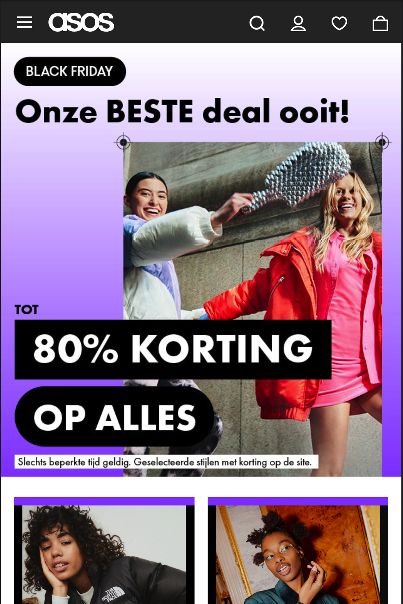
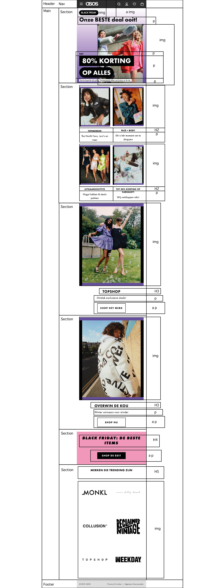
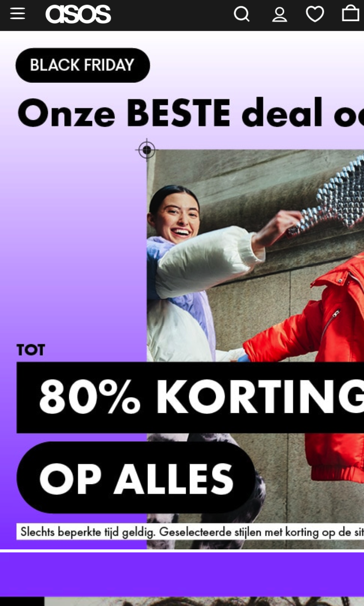
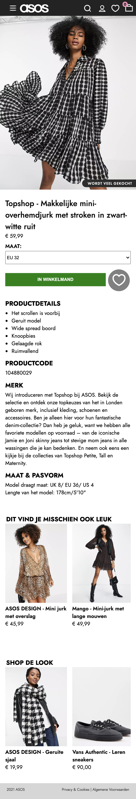

# Procesverslag
Markdown is een simpele manier om HTML te schrijven.  
Markdown cheat cheet: [Hulp bij het schrijven van Markdown](https://github.com/adam-p/markdown-here/wiki/Markdown-Cheatsheet).

Nb. De standaardstructuur en de spartaanse opmaak van de README.md zijn helemaal prima. Het gaat om de inhoud van je procesverslag. Besteedt de tijd voor pracht en praal aan je website.

Nb. Door *open* toe te voegen aan een *details* element kun je deze standaard open zetten. Fijn om dat steeds voor de relevante stuk(ken) te doen.

## Jij

uitwerken voor kick-off werkgroep

### Auteur:
Niell Elchelabi

#### Je startniveau:
Blauw

#### Je focus:
Surface Plane

## Je website

uitwerken voor kick-off werkgroep

### Je opdracht:
https://www.asos.com/nl/dames//

#### Screenshot(s) van de eerste pagina (small screen): 
Home Pagina

#### Screenshot(s) van de tweede pagina (small screen):
Detail Pagina

 

## Breakdownschets (week 1)

uitwerken na afloop 2e werkgroep

### de hele pagina: 

### dynamisch deel (bijv menu): 

## Voortgang 1 (week 2)

uitwerken voor 1e voortgang

### Stand van zaken
Ik heb moeite met op gang komen, maar als ik eenmaal bezig ben lukt het wel. Ik had een breakdown schets gemaakt en vergeleken met klasgenoten hoe bepaalde elementen toch anders gecodeert kunnen worden voor beter resultaat. Ik heb nu de html van 1 pagina en de styling voor het menu. Dit ging mij gelukkig makkelijk af. Wel wat moeite met de navigatie menu maar dit uiteindelijk wel gelukt.

### Verslag van meeting
hier na afloop snel de uitkomsten van de meeting vastleggen

- Betere oplossing vinden voor het hamburgermenu hoe ik deze ga laten transitionen. 

## Voortgang 2 (week 3)

uitwerken voor 2e voortgang

### Stand van zaken
Ik ben gaan kijken waar ik op mijn website een mictrointeractie kan bouwen. De asos website heeft er heel veel maar ik wil 1 uitkiezen wat ik begrijp en niet te moeilijk is. Zo wou ik ook mijn website responsive maken maar dat vond ik te lastig dus heb ik ervoor gekozen om me te focussen op mijn surfaceplan. Hiervoor kies ik 5 onderwerpen uit die ik ga toepassen. Paar die ik heb gekozen zijn - Navigatie beweegbaar maken
- Dark/light mode
- Prefered reduced mode 
In mijn laatste section op de pagina staan de merken van de website, deze heb ik als losse afbeeldingen ingeladen en zelf gekeken hoeveel width en margin nodig heeft. 

### Agenda voor meeting

### Verslag van meeting
hier na afloop snel de uitkomsten van de meeting vastleggen

- Ik heb mijn werk aan een klasgenoot (Jaclyn) laten zien en ze vond dat ik goed op weg ben en het handig is om te kijken of mijn animatie haalbaar is en of ik daar tijdig hulp voor moet zoeken. 
- Paar klasgenoten hadden ook de 2e pagina al, html en simpele css.

## Toegankelijkheidstest (week 4)

uitwerken na test in 8e voortgang

### Bevindingen
Lijst met je bevindingen die in de test naar voren kwamen:

#### Titel eerste bevinding
Hier korte omschrijving (met indien nodig een afbeelding)

Hier een omschrijving van hoe het opgelost kan worden (met indien nodig een afbeelding)

#### Titel tweede bevinding. 
Hier korte omschrijving (met indien nodig een afbeelding)

Hier een omschrijving van hoe het opgelost kan worden (met indien nodig een afbeelding)

#### Titel volgende bevinding. 
Hier korte omschrijving (met indien nodig een afbeelding)

Hier een omschrijving van hoe het opgelost kan worden (met indien nodig een afbeelding)

#### Titel nog een bevinding. 
Hier korte omschrijving (met indien nodig een afbeelding)

Hier een omschrijving van hoe het opgelost kan worden (met indien nodig een afbeelding)

## Voortgang 3 (week 4)

uitwerken voor 3e voortgang

### Stand van zaken
De pagina voor mijn 1e pagina is helemaal af, html, css en js. Ik ben nu bezig met mijn 2e pagina waarin ik een animatie ga ontwikkelen. Zodra een product in de winkelmand wordt geplaatst verandert "0" naar een "1" en hiervoor ga ik javascript gebruiken. Hoe precies, weet ik nog niet dus daar ik ga hulp voor vragen via mijn oud klasgenoot. 

### Agenda voor meeting
samen met je groepje opstellen

| student 1      | student 2          | student 3    | student 4        |
| ---            | ---                | ---          | ---              |
| dit bespreken  | en dit             | en ik dit    | en dan ik dat    |
| en dat ook nog | dit als er tijd is | nog een punt | dit wil ik zeker |
| ...            | ...                | ...          | ...              |

### Verslag van meeting
hier na afloop snel de uitkomsten van de meeting vastleggen

- Oplossing vinden voor mijn animatie idee.
- Leren hoe ik een hover van producten in een section plaats.

## Eindgesprek (week 5)

uitwerken voor eindgesprek

### Stand van zaken
Beide pagina's zijn af waarbij ik heb gefocust op wat ik zelf kan en begrijp ipv het te moeilijk voor mezelf maken. Ik ben een herkanser uit het 4e jaar dus voor mij is het vak oké gegaan en heb ik alles simpel en duidelijk mogelijk geprobeert te maken. Ik heb veel gehad aan alle lesslides op DLO en de losse oefeningen. 

### Screenshot(s)

hier screenshot(s) van je eindresultaat

## Bronnenlijst

continu bijhouden terwijl je werkt

Nb. Wees specifiek ('css-tricks' als bron is bijv. niet specifiek genoeg).

1. https://www.w3schools.com/jsref/prop_element_classlist.asp
2. https://css-tricks.com/snippets/css/a-guide-to-flexbox/
3. https://www.w3schools.com/cssref/pr_dim_width.asp
4. https://developer.mozilla.org/en-US/docs/Web/HTML/Element/select
5. https://stackoverflow.com/questions/9419263/how-to-play-audio
6. https://www.w3schools.com/cssref/css_selectors.asp
7. https://developer.mozilla.org/en-US/docs/Web/CSS/position
8. https://www.w3schools.com/css/css3_fonts.asp

